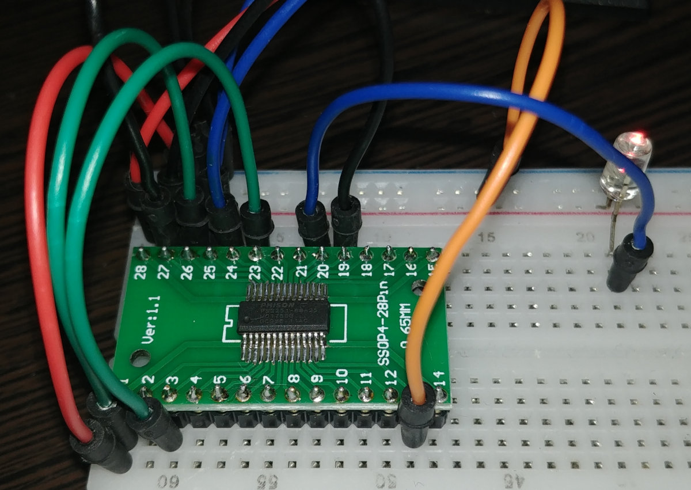

# Phison PS2251-68

## General specs

- Intel 8051 MCU
  - 256 byte IDATA
  - runs at 60 MHz??
- at least 48k of the SRAM (not counting 8051's DATA/IDATA)
- USB 2.0 High-speed device
  - (probably) 4 endpoints (ep0: control, ep1: bulk in, ep2: bulk out, ?? ep3: interrupt ??)
- NAND flash interface
  - 8-bit bus width
  - 2 chip selects
  - DQS signal
  - some randomizer/ecc stuff
  - DMA (of course)

## Contents

- [Some info](info/)
  - [Pinout](info/pinout.md)
  - [Some texts (needs cleanup)](info/texts/)
- [Some programs](progs/)

## See also

- [Psychson](https://github.com/brandonlw/Psychson) - a custom firmware for PS2251-03 (very different from PS2251-68!)
- [Some "Phisonresearch" forum](https://phisonresearch.freeforums.net/) - seems to be dead, but anyway
