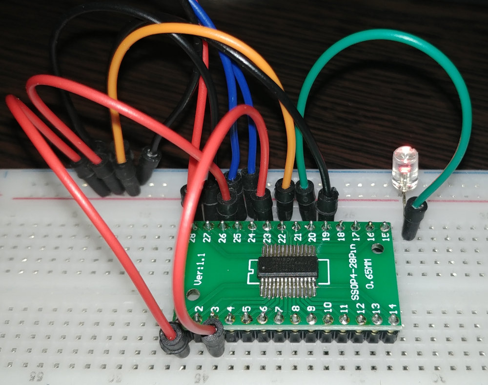
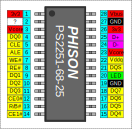

# Phison PS2251-68



## General specs

- Intel 8051 MCU
  - 256 byte IDATA
  - runs at 60 MHz??
- at least 48k of the SRAM (not counting 8051's DATA/IDATA)
- USB 2.0 High speed device
  - (probably) 4 endpoints (ep0: control, ep1: bulk in, ep2: bulk out, ?? ep3: interrupt ??)
  - automatic handling of the SET_ADDRESS control request...
  - ... also ignores the SET_CONFIGURATION control request...
- NAND flash interface
  - 8-bit bus width
  - 2 chip selects
  - DQS signal
  - V<sub>DDQ</sub> output
  - some randomizer/ecc stuff
  - DMA (of course)

## Contents

- [Some texts](texts/)
- [Some programs](prog/)

## Pinout

- Package: SSOP28



```
          ________
   Vdd --|o       |-- Vbus
     ? --|        |-- GND
 Vcore --|        |-- Vdd
   DQ0 --|   PS   |-- D+
   CLE --|  2251  |-- D-
   ALE --|   -68  |-- Vcore
   WE# --|        |-- Vddq
   RE# --|        |-- DQS
   DQ1 --|        |-- LED
   DQ2 --|        |-- GND
   DQ3 --|        |-- DQ7
  CE0# --|        |-- DQ6
  R/B# --|        |-- DQ5
  CE1# --|________|-- DQ4
```

## See also

- [Psychson](https://github.com/brandonlw/Psychson) - a custom firmware for PS2251-03 (very different from PS2251-68!)
- [Some "Phisonresearch" forum](https://phisonresearch.freeforums.net/) - seems to be dead, but anyway
