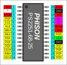

# PS2251-68 pinout

- Package: SSOP28

|  # | Signal               |
|----|----------------------|
|  1 | 3.3v voltage (1)     |
|  2 | ?                    |
|  3 | 1.2v core voltage    |
|  4 | NAND DQ0             |
|  5 | NAND CLE             |
|  6 | NAND ALE             |
|  7 | NAND WE#             |
|  8 | NAND RE#             |
|  9 | NAND DQ1             |
| 10 | NAND DQ2             |
| 11 | NAND DQ3             |
| 12 | NAND CE0#            |
| 13 | NAND R/B#            |
| 14 | NAND CE1#            |
| 15 | NAND DQ4             |
| 16 | NAND DQ5             |
| 17 | NAND DQ6             |
| 18 | NAND DQ7             |
| 19 | Ground               |
| 20 | LED output           |
| 21 | NAND DQS             |
| 22 | 3.3v voltage (2)     |
| 23 | 1.2v core voltage    |
| 24 | USB D-               |
| 25 | USB D+               |
| 26 | 3.3v voltage (3)     |
| 27 | Ground               |
| 28 | 5v VBUS in           |
